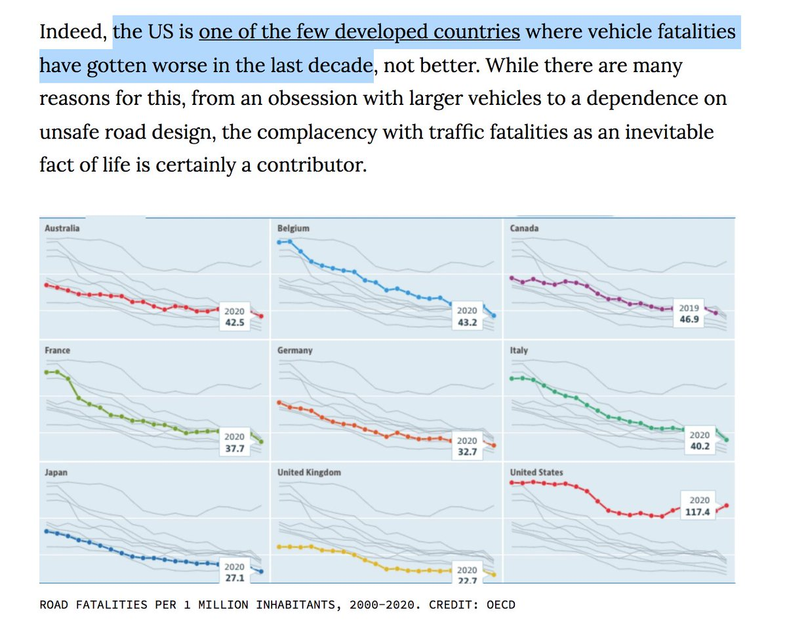

# Data Visualization Critique

In this file we have data visualizations that will form the background of some discussions in class. In all cases I've linked to the tweet where I first saw the image.

## Example 1

[Military Spending](https://twitter.com/GoodPoliticGuy/status/1488193872803074048/photo/1) graph.

* What are the visual encodings the author is using? 
* What would be a better headline?

## Example 2

[US Economic Growth](https://twitter.com/MarcGoldwein/status/1486797802097283073)

* What are the strengths of this image?
* What are the weaknesses?

## Example 3

[Road Fatalities](https://twitter.com/RottenInDenmark/status/1485152222816215040)

* What visual encodings is the author making use of? 
* Do you feel like the "small multiples" are effective?

## Example 4

[Women's Heights](https://twitter.com/yeoldedad/status/1456609564690837507)

* What visual encodings is the author using?
* What would make this chart more effective? 

## Example 5

[Baby Boomers' Self Descriptions](https://twitter.com/MaartenvSmeden/status/1442765690591760384)

* What visual encodings is the author using?
* What style chart would make this more effective?  

